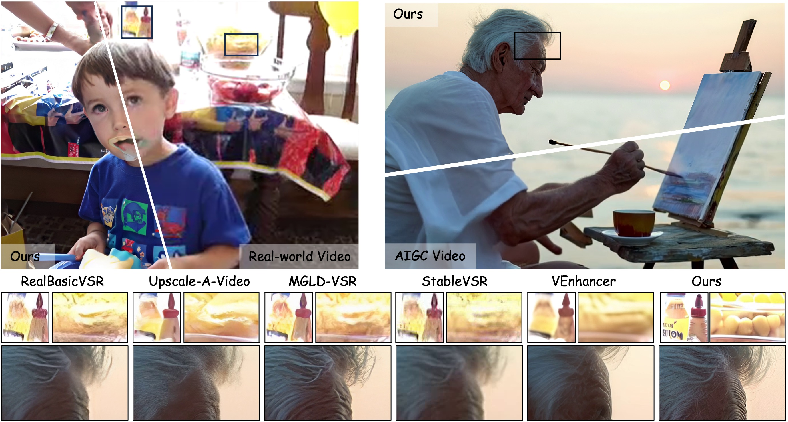
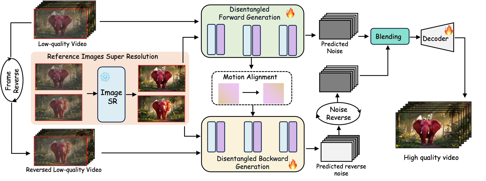

<div align="center">
<h1>DAM-VSR: Disentanglement of Appearance and Motion for Video Super-Resolution (ACM SIGGRAPH 2025)</h1>

[Zhe Kong](https://scholar.google.com/citations?user=4X3yLwsAAAAJ&hl=zh-CN) · [Le Li]() · [Yong Zhang*](https://yzhang2016.github.io/) · [Feng Gao](https://scholar.google.com/citations?user=lFkCeoYAAAAJ) · [Shaoshu Yang](https://scholar.google.com/citations?user=JrdZbTsAAAAJ&hl=en) · [Tao Wang](https://taowangzj.github.io/) · [Kaihao Zhang](https://zhangkaihao.github.io/)  · [Zhuoliang Kang](https://scholar.google.com/citations?user=W1ZXjMkAAAAJ&hl=en) · 

[Xiaoming Wei](https://scholar.google.com/citations?user=JXV5yrZxj5MC&hl=zh-CN) · [Guanying Chen](https://guanyingc.github.io/) · [Wenhan Luo*](https://whluo.github.io/)

<sup>*</sup>Corresponding Authors


<a href=''></a>
<a href='https://kongzhecn.github.io/projects/dam-vsr/'></a>
<a href='https://huggingface.co/Fucius/DAM-VSR'></a>
<a href=https://github.com/kongzhecn/DAM-VSR></a>
[](https://github.com/kongzhecn/DAM-VSR)

</div>
   


<p align="center">
  
</p>

## :label: Change Log 

- [2025/7/2] 🔥 We release the [source code](https://github.com/kongzhecn/DAM-VSR) and [technical report]() of DAM-VSR.


## 🔆 Method Overview
<p align="center">
  
</p>

## :wrench: Dependencies and Installation

The code requires `python==3.10.14`, as well as `pytorch==2.1.1` and `torchvision==0.16.1`. Please follow the instructions [here](https://pytorch.org/get-started/locally/) to install both PyTorch and TorchVision dependencies. Installing both PyTorch and TorchVision with CUDA support is strongly recommended. The project has been tested on CUDA version of 12.1.

```bash
conda create -n dam-vsr python=3.10.14
conda activate dam-vsr
pip install torch==2.1.1 torchvision==0.16.1 torchaudio==2.1.1 --index-url https://download.pytorch.org/whl/cu121
pip install xformers==0.0.23 --index-url https://download.pytorch.org/whl/cu121
pip install -r requirements.txt
```


## ⏬ Pretrained Model Preparation

### 1) Automatic Download

You can directly download all the required model through the following command:
```
python download.py
```
All the models will be downloaded to the `checkpoints` path. Alternatively, you can download each model manually.


### 2) Manual Download

Download the following models and put them to the `checkpoints` path.

##### 1. Video Super-Resolution Models: [stabilityai/stable-video-diffusion-img2vid](https://huggingface.co/stabilityai/stable-video-diffusion-img2vid).

##### 2. SupIR: [stabilityai/stable-diffusion-xl-base-1.0](https://huggingface.co/stabilityai/stable-diffusion-xl-base-1.0), [openai/clip-vit-large-patch14-336](https://huggingface.co/openai/clip-vit-large-patch14-336), [liuhaotian/llava-v1.5-13b](https://huggingface.co/liuhaotian/llava-v1.5-13b), [openai/clip-vit-large-patch14](https://huggingface.co/openai/clip-vit-large-patch14), [laion/CLIP-ViT-bigG-14-laion2B-39B-b160k](https://huggingface.co/laion/CLIP-ViT-bigG-14-laion2B-39B-b160k), [SUPIR-v0Q](https://drive.google.com/drive/folders/1yELzm5SvAi9e7kPcO_jPp2XkTs4vK6aR?usp=sharing).

##### 3. InvSR: [stabilityai/sd-turbo](https://huggingface.co/stabilityai/sd-turbo), [noise_predictor_sd_turbo_v5.pth](https://huggingface.co/OAOA/InvSR/resolve/main/noise_predictor_sd_turbo_v5.pth)

##### 4. ResShift: [resshift_realsrx4_s4_v3.pth](https://github.com/zsyOAOA/ResShift/releases/download/v2.0/resshift_realsrx4_s4_v3.pth), [autoencoder_vq_f4.pth](https://github.com/zsyOAOA/ResShift/releases/download/v2.0/autoencoder_vq_f4.pth)

##### 5. DAM-VSR: [Fucius/DAM-VSR](https://huggingface.co/Fucius/DAM-VSR)

The `checkpoints` directory structure should be arranged as:
```
checkpoints
    ├── stable-diffusion-xl-base-1.0
    ├── sd-turbo
    ├── DAM-VSR
    │       ├── SUPIR-v0Q.ckpt
    │       ├── controlnet
    │       ├── unet
    │       ├── lora
    │       ├── autoencoder_vq_f4.pth
    │       └── resshift_realsrx4_s4_v3.pth
    ├── clip-vit-large-patch14-336
    ├── llava-v1.5-13b
    ├── CLIP-ViT-bigG-14-laion2B-39B-b160k
    ├── stable-video-diffusion-img2vid
    ├── clip-vit-large-patch14
    └── noise_predictor_sd_turbo_v5.pth
```

## 🚀 Inference
For image super-resoolution, you can choose [SupIR](https://github.com/Fanghua-Yu/SUPIR), [InvSR](https://github.com/zsyOAOA/InvSR) or [ResShift](https://github.com/zsyOAOA/ResShift).

For real-world or AIGC videos, it is recommended to utilize `SupIR` or `InvSR` for image super-resolution. Among them, `SupIR` can achieve the best visual effects, while `InvSR` can achieve the best evaluation metrics.
```
python infer.py \
    --validation_data_dir="example/example1.mp4" \
    --max_cfg 3.0 \
    --backwrad_scale 0.3 \
    --sr_type="supir" \ # or "invsr"
    --use_usm
```

For synthetic degradations, it is recommended to utilize `ResShift` for image super-resolution.
```
python infer.py \
    --validation_data_dir="example/example1.mp4" \
    --max_cfg 1.0 \
    --backwrad_scale 1.0 \
    --lora_path='checkpoints/DAM-VSR/lora/vae-decoder.safetensors' \
    --sr_type="resshift"
```

We also provide a lighter version that does not use bidirectional sampling for accelerated generation.
```
python infer_accelerated.py \
    --validation_data_dir="example/example1.mp4" \
    --sr_type="supir" \ # invsr/resshift
    --use_usm
```


## ❤️ Acknowledgments
This project is based on [SupIR](https://github.com/Fanghua-Yu/SUPIR), [InvSR](https://github.com/zsyOAOA/InvSR), [ResShift](https://github.com/zsyOAOA/ResShift), [svd-temporal-controlnet](https://github.com/CiaraStrawberry/svd-temporal-controlnet) and [svd_keyframe_interpolation](https://github.com/jeanne-wang/svd_keyframe_interpolation). Thanks for their awesome works.


## 🎓Citations
If our project helps your research or work, please consider citing our paper:
```
@inproceedings{kong2025dam,
  title={DAM-VSR: Disentanglement of Appearance and Motion for Video Super-Resolution}, 
  author={Zhe Kong, Le Li, Yong Zhang, Feng Gao, Shaoshu Yang, Tao Wang, Kaihao Zhang, Zhuoliang Kang, Xiaoming Wei, Guanying Chen, Wenhan Luo},
  year={2025},
  booktitle={ACM SIGGRAPH 2025},
}
```